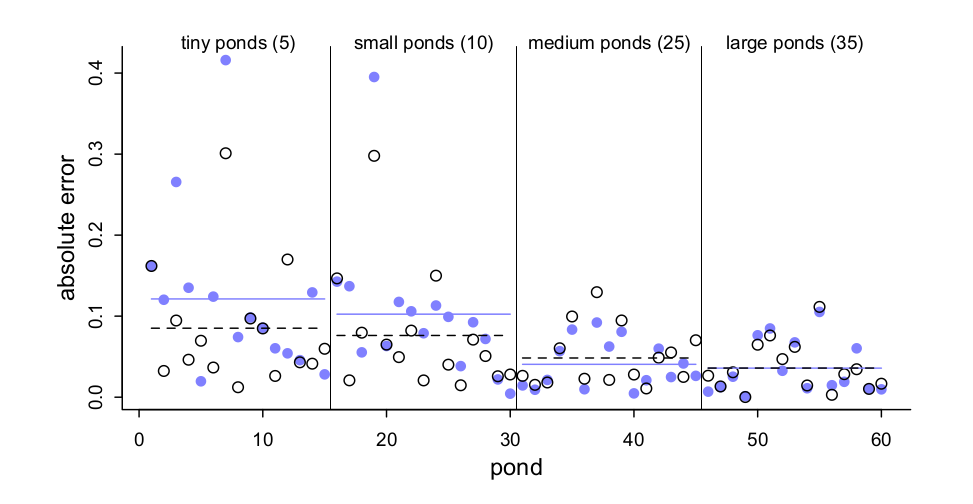

```{r setup, include=FALSE}
library(knitr)
options(htmltools.dir.version = FALSE)
opts_chunk$set(echo = FALSE, comment = NULL)
```
class: large
## QMER: What we do

QMER is a open learning community serving all of Auburn University by providing:

* Support for Statistics, Project Management, and Workflow

* Professional skills not taught in your courses

* Research labs, teaching opportunities

* Large scale public data sets

---
class: large
## Outline of the Workshop

* A few words about science 

* Conceptual Primer on Multilevel Modeling (MLM)

* Example of a two level MLM

---
class: inverse middle center large

# Science is Model Building

---
class: large
## The Scientific Process

* **Goals of Science**: *Describe, Predict, Explain*

* All these require (over)simplifying reality

* **Modeling** is a *rigorous, systematic, transparent* way to simplify reality

---
class: large

## What are Scientific Models?


> *Models are explicit statements about the processes that give rise to observed data.*  - Little (2013)

> *A mathematical model is a set of assumptions together with implications drawn from them by mathematical reasoning.* - Neimark and Estes (1967 quoted in Rodgers, 2010)

* Models are representations of how our key constructs are related.
* They can be narrative, graphical, or mathematical. 
* Models   
       1. match reality in some way, and,   
       2. are simpler than reality.

---
class: large

## Why do we need models?


If we acknowledge the .red[**complexity**] and .red[**interrelatedness**] of reality, and our goal is the perfect model, we soon realize **To model anything, we would have to model everything**!

--

*All models are wrong, but some are useful* - George Box

--

So, it is important to **not confuse your model with reality**

---
class: large

## Occam's Razor


* We need to balance explanatory power (complexity) with parsimony (simplicity)
* We want to constantly ask: "What do we gain by adding complexity?"
* **ALL METHODS** simply the phenomenon they are used to study.
* This is not a limitation, but a design feature.
* The researcher (not the method) chooses how to balance simplicity and complexity.
* As data become more complex, our explanations should become more complex, and so, **the complexity of our data analysis should match the complexity of our explanations** (i.e. theory).


---
class: inverse center middle

# Conceptual Introduction to Multilevel Modeling
### Why it should be the default method

---
class: big2
## Some Key Assumptions of Regression Models

--
* **Normality** - The errors (residuals) are normally distributed, with an expected mean of zero (unbiased).

--
* **Constant Variance**(Homogeneity of variance; Identically distributed) - The variance of the errors is constant across values of the explanatory variables.

--
* **No measurement error in predictors** - The predictors are measured without error. **THIS IS AN IMPORTANT AND ALMOST ALWAYS VIOLATED ASSUMPTION**.

--
* **Independence** - The observations are sampled independently (the residuals are independent).


---
class: large
## Examples of Multilevel Models

* Clustered data (students within classrooms, within schools)
* Longitudinal data (time within individual)
    - Repeated measures designs
    - Some time series models
    - Functional data analysis
    - Intensive longitudinal models
    
---
class: large
## Other Methods that can benefit for MLM

* Missing data imputation
* Models of measurement error
* Latent Variable Modeling (SEM)
    - Factor analysis
    - Multilevel Path Analysis and Mediation
    - Multilevel Structural Equation Models (MSEM)

* Types of spatial and network models 

---
class: big1
## Some bad alternatives to MLM 

.pull-left[
### Aggregation

* Variables at a lower level are moved to higher level (e.g., averaging over trials)
* Loss of information
* Loss of power
]

.pull-right[
### Disaggregation

* Variables at a higher level are moved to lower level (assigning each student the class size)
* Type I error rate inflated
]
--
.center[
### Interpretation Errors
]
* *ecological fallacy* - interpreting aggregated data at a lower level based on analysis at a higher level
* *atomistic fallacy* - inferring from lower level to higher level.
--

#### Multilevel models help avoid all this

---
class: large

## Good alternatives to MLM when the hierarchical structure is not of interest

* Fixed Effects Models - You can include fixed effects for the nesting variable

* Robust Cluster Standard Errors - Uses the sandwich estimator to adjust for the design effect in the data.

---

## Intraclass Correlation and Design Effect

### ICC
$$\rho = \frac{\sigma^2_b}{\sigma^2_b + \sigma^2_w}$$

* The ICC refers to the proportion of variance between nesting groups, to the total variance of the outcome, which includes the between and within group variances.

* The ICC can also be interpreted as the expected correlation between any two randomly selected case within a group.

-- 
### Design Effect

$$deff = 1 + (\text{average group size} - 1*\rho)$$

* The design effect is a function of the ICC and the average group size.

---
class: big2
## Models with Memory

Multilevel models help by pooling information across clusters, but in a way that maximizes the available information.

If we have clustered data we can deal with in in three basic ways:

--

1. **complete pooling** - Ignore clustering. Just completely pool information across clusters. We will assume that the clusters are from identical populations.
--

2. **no-pooling** - Analyze each cluster separately  (or include dummy variables for clusters). Like anterograde amnesia. All populations are independent. 
--

3. **partial-pooling** Models with memory (MLM). Using information across clusters to regularize estimates. Pooling, estimates are weighted by the available information in the clusters.

---

## Partial Pooling

.pull-left[

]

.pull-right[

* **X-axis** Pond number, organized by number of tadpoles. 
* **Y-axis** - Absolute error in the predicted proportion of survivors,
compared to the true value used in the simulation.
* The higher the point, the worse the estimate. 
* **blue points** - No-pooling estimates. (regression with dummy variables)
* **black open points** - Partial-pooled estimates (MLM)
* The blue and dashed black lines show the average error for each
kind of estimate, across each initial density of tadpoles (pond size). 
* Smaller ponds produce more error, but the partial pooling estimates are better on
average, especially in smaller ponds.
]

???

Reedfrog mortality
* tadpoles clustered in ponds
* ponds differ on many unmeasured properties

---
class: large
## Benefits of Partial Pooling

* **To adjust estimates for repeated sampling**: within clusters or within individuals

* **To adjust for imbalance in sampling**: When some individuals within clusters or some times within individuals are sampled more than others.

* **To study variation**: Variability is explicitly model in MLM.

* **To avoid averaging**: Averaging is dangerous as it removes variability, making models over-confident. ML uses all data  while still using the average to make predictions, but preserving uncertainty.

---
class: large
## There's No Free Lunch

* MLM models are more **complex**, and can be hard to understand
* Require more complex theories
* MLM models require more **computational intensity** (Maximum Likelihood or Bayesian Estimation)
* MLM makes **additional assumptions** (distribution of parameters)
* Can require larger **sample sizes** (though Bayesian methods can help if done correctly)


---
class: large
## MLM should be the default approach

* There will be contexts in which single-level is better, but the contexts in which MLM are superior are numerous.
* It is better to build a multilevel model and learn it is not needed than to assume it is not and never know.
* Variability is important, and should be a part of our models.
* Because reality is naturally hierarchically organized, so  should our theoretical models and the resulting statistical models should used to test them.


???
Injuries may not only change average performance, but may also lead to more variability in performance.

???

Add model comparison section

## Model Comparison Approach

1. Design the model (data generation process)

2. Condition on the data (update)

3. Evaluate the model (critique)

4. Repeat!

---
class: large
## Estimation and Software

### Estimation

* MLM requires moving beyond OLS to more complex methods of estimation
* These include versions Maximum Likelihood (ML) and Bayesian methods.
* Both are require iterative processes, which can be time consuming and require convergence (which may fail)

### Software

* I use R almost exclusively
* Mplus is also good for MLM particularly with latent variables


